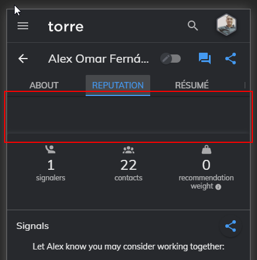
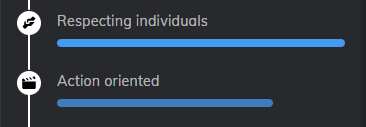

# Torre Genome Redesign

The site was hosted in AWS using a s3 bucket.

You can access the site using [Genome](http://torre-genome.s3-website-us-west-2.amazonaws.com/my-genome)

# Key Points

- Reduce the space on top of the columns; space is more notable in the mobile version.


- Provide more details about the culture dynamics, at first glance you don't know what is that blue bar


- Space between columns in my opinion was too much


- Alexander said in a [video](https://cdn2.hubspot.net/hubfs/5943984/Torre%20-%20Our%20journey.mp4)
that you guys killed the resume and create something totally different with torre, but you still have résumé as a column


# Data Analysis

- The results for the personality traits were no right, the values shown for each trait were not valid, in fact, it was from another trait.

**extraversion details**


as you can see in the following JSON (taken from my genome), the result analysis for extraversion is 4; it isn't 3.88; that value is for openness-to-experience

```json
"personalityTraitsResults": {
"groups": [
{"id": "extraversion", "order": 0, "median": 3.5, "stddev": 0.57},
{
"id": "openness-to-experience",
"order": 1,
"median": 3.41,
"stddev": 0.6
},
{"id": "conscientiousness", "order": 2, "median": 3.44, "stddev": 0.56},
{"id": "agreeableness", "order": 3, "median": 2.94, "stddev": 0.58},
{"id": "honesty-humility", "order": 4, "median": 3.19, "stddev": 0.62},
{"id": "emotionality", "order": 5, "median": 3.43, "stddev": 0.62}
],
"analyses": [
{"groupId": "openness-to-experience", "analysis": 3.88},
{"groupId": "honesty-humility", "analysis": 4.13},
{"groupId": "agreeableness", "analysis": 3},
{"groupId": "altruism", "analysis": 4.5},
{"groupId": "conscientiousness", "analysis": 4.19},
{"groupId": "emotionality", "analysis": 3.75},
{"groupId": "extraversion", "analysis": 4}
]
},

```

# You should take a look at 
- How the about section is being display


-The verified badge is on top of the image

-The column name is being shown as a ribbon

-The name, headline, location, and summary are more noticeable

- Sub-sections are more compact


-The division and the subsection title are in the same line, which provides a clear view

-The tags are ordered by length; shorter words will be shown first; that way, we prevent death space and more lines than required

- The resume section was rename to **Professional Experience**


- The personality traits now shows a genome with the different traits, when you hover/click on each you will see the details.


-The details now show the rigth analysis value
-The normal distribution is still being show but in a more interactive way
-The HEXACO group names are being shown


- The professional culture section now is being display using tabs to group the culture values by frecuency


-Instead of having a huge repetitive blue bar, we now group the values
-The values are being display alternating the position to provide a clean view and brin more flow to the info.


# LOG

**_commit 7805c0366b0afc7822351550fe3fb477ce6e10c5 (HEAD -> develop, origin/develop)_**
Author: lexfernandez <olorenzo@outlook.com>
Date: Tue Dec 29 01:27:00 2020 -0600

    Add 404 message :D

**_commit e5f9c2648ddabe695bed3980cb53ccedd4c13e59_**
Author: lexfernandez <olorenzo@outlook.com>
Date: Tue Dec 29 01:19:41 2020 -0600

    Group professional culture dynamics per frecuency

**_commit ff28ac5808578696b8dbe89a2589d0ab2145e02f_**
Author: lexfernandez <olorenzo@outlook.com>
Date: Tue Dec 29 01:19:07 2020 -0600

    Refactor genome

    remove console logs
    show message error to user
    remove make useEffect function async modifier

**_commit 22c5f49a64b21a07dabf8aa7b3b5e87e365178f8_**
Author: lexfernandez <olorenzo@outlook.com>
Date: Tue Dec 29 01:17:23 2020 -0600

    use triple equals operator

**_commit beb415ec41077462305277ca7efc0c4d81749665_**
Author: lexfernandez <olorenzo@outlook.com>
Date: Tue Dec 29 00:16:05 2020 -0600

    Update profile header

**_commit 96e53710c5f02673f600dda98a82731c539794e3_**
Author: lexfernandez <olorenzo@outlook.com>
Date: Mon Dec 28 23:26:22 2020 -0600

    Use index as tags key

**_commit 0c08871de32fa75171e6590e9fdda9eefe1398a8_**
Author: lexfernandez <olorenzo@outlook.com>
Date: Mon Dec 28 23:26:10 2020 -0600

    Add person context to personality traits

    Show name on personality details

**_commit 9d818b36eaa486cc238fc8b018a22cf910b203c2_**
Author: lexfernandez <olorenzo@outlook.com>
Date: Mon Dec 28 23:25:07 2020 -0600

    Add utils library

**_commit 56ee9b8d399c61aefd4e6de36abc605fe055ba26_**
Author: lexfernandez <olorenzo@outlook.com>
Date: Mon Dec 28 23:20:43 2020 -0600

    Add context to access the person data on professional culture results

**_commit b01251626bdd28d9b79c334b1bca4c64e994689e_**
Author: lexfernandez <olorenzo@outlook.com>
Date: Mon Dec 28 22:57:46 2020 -0600

    Add ribbon to show columns name

**_commit a77e26d88871506063f5b10339045f161abbf2ec_**
Author: lexfernandez <olorenzo@outlook.com>
Date: Mon Dec 28 22:56:44 2020 -0600

    Add error message when request failed

    A fake genome will be shown when the request failed

**_commit c92f0e16958fb570f3c5e5c7179a74ec1b02fd34_**
Author: lexfernandez <olorenzo@outlook.com>
Date: Mon Dec 28 22:51:59 2020 -0600

    Implement card component on genome page

**_commit 1a4fd492a68e711bc28a420fa961067740310e1b_**
Author: lexfernandez <olorenzo@outlook.com>
Date: Mon Dec 28 22:51:02 2020 -0600

    Add form to request username

**_commit e14e6ee819d00010925cfa3558864b19d8e5947a_**
Author: lexfernandez <olorenzo@outlook.com>
Date: Mon Dec 28 22:50:02 2020 -0600

    Add card component

**_commit 56fdf45e4ee63294630c5eddcd6cbacdb4f71d86_**
Author: lexfernandez <olorenzo@outlook.com>
Date: Mon Dec 28 21:57:23 2020 -0600

    Move genome to the container folder

**_commit e99933068303353836b27a772b48048fe1e89300_**
Author: lexfernandez <olorenzo@outlook.com>
Date: Mon Dec 28 21:54:49 2020 -0600

    Add api request to retrieve bio info

**_commit 8174372bb384b8dac973ac45751b458848decebc_**
Author: lexfernandez <olorenzo@outlook.com>
Date: Mon Dec 28 21:52:54 2020 -0600

    Show loading indicator for profile and behavior columns

**_commit e7a71daee64d60e2588f60942ea45ca7808eb656_**
Author: lexfernandez <olorenzo@outlook.com>
Date: Mon Dec 28 21:38:17 2020 -0600

    Set profile location properties as optional

**_commit cd4cc66515e4871fe0bfe329828598fffb38756f_**
Author: lexfernandez <olorenzo@outlook.com>
Date: Mon Dec 28 21:37:37 2020 -0600

    Remove unused code

**_commit 103c2e90f6944cfc3d463a455fd40762081f38db_**
Author: lexfernandez <olorenzo@outlook.com>
Date: Mon Dec 28 21:37:05 2020 -0600

    Update my-genome route to accept username as url param

**_commit 0ffa9735a512b7fa2299be2fe1e11ebb5f56ee21_**
Author: lexfernandez <olorenzo@outlook.com>
Date: Mon Dec 28 21:34:23 2020 -0600

    Add axios and set base url

**_commit ccc5c4a75edfdbf433ab7488837057857b299388_**
Author: lexfernandez <olorenzo@outlook.com>
Date: Mon Dec 28 21:32:59 2020 -0600

    Center professional culture section

**_commit ad967208c6311e34e524fd47d6a0d2465933ea10_**
Author: lexfernandez <olorenzo@outlook.com>
Date: Mon Dec 28 21:32:35 2020 -0600

    Remove unused classes

**_commit 8be5a0888a1994a13448c8e2ac528d0c6707e0a2_**
Author: lexfernandez <olorenzo@outlook.com>
Date: Mon Dec 28 19:11:22 2020 -0600

    Show analysis description as tooltip

**_commit c110116a9bdb63b2d3650406436c8b0b02618e91_**
Author: lexfernandez <olorenzo@outlook.com>
Date: Mon Dec 28 19:03:01 2020 -0600

    Show selected hexagonal graph piece

**_commit 79f3c4746c40708b33154983e2cfbc11f84e56a9_**
Author: lexfernandez <olorenzo@outlook.com>
Date: Mon Dec 28 18:54:54 2020 -0600

    Set picture prop as optional

**_commit 76774ab32ac30ee33b6dc8749737f897f2e2b34b_**
Author: lexfernandez <olorenzo@outlook.com>
Date: Mon Dec 28 18:54:37 2020 -0600

    Prevent error when personalityTraits / professionalCulture are undefined

**_commit 9f3491b9f8160b311862565ab970de77bb13a6ab_**
Author: lexfernandez <olorenzo@outlook.com>
Date: Mon Dec 28 18:51:41 2020 -0600

    Fix behavior props validations

**_commit bd1019395364a60df7f2f2cff31f018cc4dafa2b_**
Author: lexfernandez <olorenzo@outlook.com>
Date: Mon Dec 28 18:50:06 2020 -0600

    Add personality trait details

**_commit b8cb1d422fcbd2cf48d3e5b1d1c82d36304dbeb4_**
Author: lexfernandez <olorenzo@outlook.com>
Date: Mon Dec 28 17:16:41 2020 -0600

    Add hexagone design to profile picture

**_commit 11bdfa4012a5aef0196fb2b3f430521a6d413d36_**
Author: lexfernandez <olorenzo@outlook.com>
Date: Mon Dec 28 16:05:57 2020 -0600

    Set height and hide scroll for professional culture section

**_commit 44beaffb0cef6ee0951bfacef7efcbcf381be0df_**
Author: lexfernandez <olorenzo@outlook.com>
Date: Mon Dec 28 16:05:13 2020 -0600

    Add no result message when no dynamics are found

**_commit 15e8269a3ce4180a470081931658985593094628_**
Author: lexfernandez <olorenzo@outlook.com>
Date: Mon Dec 28 15:23:20 2020 -0600

    Add key to HexGraph a tags

**_commit 7c73c767725cc143b4668624661d1ee92035d9bf_**
Author: lexfernandez <olorenzo@outlook.com>
Date: Mon Dec 28 15:22:36 2020 -0600

    Set default visible result

**_commit 99f9cc4834ace4387f680e32fe5aca19d92e31a4_**
Author: lexfernandez <olorenzo@outlook.com>
Date: Mon Dec 28 15:22:27 2020 -0600

    Validate personal traits results

**_commit 770f8b2dce837c8e7281e50d3eaa5b4cc02c3c31_**
Author: lexfernandez <olorenzo@outlook.com>
Date: Mon Dec 28 15:21:21 2020 -0600

    Show professional culture dynamics percentage value

**_commit 5c664ff0048146922292eff6266221a24dd5c97a_**
Author: lexfernandez <olorenzo@outlook.com>
Date: Mon Dec 28 13:12:23 2020 -0600

    Add HexGraph to show personality traits

**_commit ef09fd1a59ae16ff6d867968832ec3220be1f887_**
Author: lexfernandez <olorenzo@outlook.com>
Date: Mon Dec 28 11:12:01 2020 -0600

    Fix initial value to personality traits

**_commit 80b025733575db09606dabbcda02cdfa0471ee0b_**
Author: lexfernandez <olorenzo@outlook.com>
Date: Mon Dec 28 11:11:41 2020 -0600

    Add profesional culture to behaviour column

**_commit ce6c3ba8a348500511555f61a1917c560b278d7e_**
Author: lexfernandez <olorenzo@outlook.com>
Date: Sun Dec 27 16:52:58 2020 -0600

    Remove console log

**_commit e8ff06f4c6fb04934159247a6ab07a8fcbb6d531_**
Author: lexfernandez <olorenzo@outlook.com>
Date: Sun Dec 27 16:45:13 2020 -0600

    Add Behaviour

    Show Personality Traits results

**_commit aff56b8756a90c88da0539ee0b2fdf10d7a812e6_**
Author: lexfernandez <olorenzo@outlook.com>
Date: Sun Dec 27 15:39:34 2020 -0600

    Refactor Skill component into Tags component

    Show Current skills
    Show Skills s/he wants to develop
    Add Industries and sectors of interest
    Add Languages

**_commit 217410ced25439a8e173c9296655a2cbb56a189b_**
Author: lexfernandez <olorenzo@outlook.com>
Date: Sun Dec 27 13:44:45 2020 -0600

    Remove unused code in summary

**_commit 80b2e000f814f600eee00232f504e41bfd81c384_**
Author: lexfernandez <olorenzo@outlook.com>
Date: Sun Dec 27 13:41:39 2020 -0600

    Sort skills and set space between tags

**_commit 9b62b86c7434bf4e9ba594326f013dff633b7275_**
Author: lexfernandez <olorenzo@outlook.com>
Date: Sun Dec 27 03:10:15 2020 -0600

    Add Skills

    Show current skills
    Show skill to develop

**_commit ad1b9a095a4d49af9a7ffebd80622d4eb14a0324_**
Author: lexfernandez <olorenzo@outlook.com>
Date: Sun Dec 27 02:02:11 2020 -0600

    Add summary

**_commit 1fbaef11dd4d056dd75c79144a1bd9926482f81e_**
Author: lexfernandez <olorenzo@outlook.com>
Date: Sun Dec 27 01:19:37 2020 -0600

    Add Profile details

    Show name
    Show picture
    Show professional headline
    Show address
    Show verified badge

**_commit 7d796bf7e27b8deefe6f24bd56fb9c4286fc61eb_**
Author: lexfernandez <olorenzo@outlook.com>
Date: Sun Dec 27 00:47:05 2020 -0600

    Add genome profile media links

**_commit 53f17eae819e2dee7a0b015d2c2a549998608cc5_**
Author: lexfernandez <olorenzo@outlook.com>
Date: Sat Dec 26 23:53:00 2020 -0600

    Add genome columns

**_commit 387456c5fc23e413187b1774f1fd22d128840a58_**
Author: lexfernandez <olorenzo@outlook.com>
Date: Sat Dec 26 23:52:09 2020 -0600

    Set content padding

**_commit 7d0c9ff79b3bbb74c63ee1ffc535abdb93fdf5d9_**
Author: lexfernandez <olorenzo@outlook.com>
Date: Sat Dec 26 23:51:55 2020 -0600

    Center logo

**_commit bb889468f7cdf8195a899da3e6d8b6c55f8e1ca5_**
Author: lexfernandez <olorenzo@outlook.com>
Date: Sat Dec 26 23:51:07 2020 -0600

    Add loading component

**_commit 84dbe312089c53ef28afa2228fbadedc8a1f75be_**
Author: lexfernandez <olorenzo@outlook.com>
Date: Sat Dec 26 23:49:37 2020 -0600

    Set body full height and width

**_commit 416a9025df9215195dfb455ce4b70266d087371b_**
Author: lexfernandez <olorenzo@outlook.com>
Date: Sat Dec 26 16:59:53 2020 -0600

    Add content margin

**_commit 0f9b7225305dddbf604ad1d07a44894cd6410322_**
Author: lexfernandez <olorenzo@outlook.com>
Date: Sat Dec 26 16:58:02 2020 -0600

    Remove webvitals log

**_commit de72277a0f0c7624186b4c097d95c8a55b99588e_**
Author: lexfernandez <olorenzo@outlook.com>
Date: Sat Dec 26 16:57:49 2020 -0600

    Add routes and side menu

**_commit fba15ab04a4857f5aa6706d376cca57efb9515c8_**
Author: lexfernandez <olorenzo@outlook.com>
Date: Sat Dec 26 16:46:52 2020 -0600

    Add default layout

**_commit 248937977949e93a76c5a5fdb64018498a4b4c47 (origin/master, master)_**
Author: lexfernandez <olorenzo@outlook.com>
Date: Sat Dec 26 13:41:02 2020 -0600

    Add antd and set dark mode

**_commit 3da55e2c62846193b4d12cf3622ae352102493ce_**
Author: lexfernandez <olorenzo@outlook.com>
Date: Sat Dec 26 11:25:43 2020 -0600

    Initialize project using Create React App


# Stuff you should know about react
## Getting Started with Create React App

This project was bootstrapped with [Create React App](https://github.com/facebook/create-react-app).

## Available Scripts

In the project directory, you can run:

### `npm start`

Runs the app in the development mode.\
Open [http://localhost:3000](http://localhost:3000) to view it in the browser.

The page will reload if you make edits.\
You will also see any lint errors in the console.

### `npm test`

Launches the test runner in the interactive watch mode.\
See the section about [running tests](https://facebook.github.io/create-react-app/docs/running-tests) for more information.

### `npm run build`

Builds the app for production to the `build` folder.\
It correctly bundles React in production mode and optimizes the build for the best performance.

The build is minified and the filenames include the hashes.\
Your app is ready to be deployed!

See the section about [deployment](https://facebook.github.io/create-react-app/docs/deployment) for more information.

### `npm run eject`

**Note: this is a one-way operation. Once you `eject`, you can’t go back!**

If you aren’t satisfied with the build tool and configuration choices, you can `eject` at any time. This command will remove the single build dependency from your project.

Instead, it will copy all the configuration files and the transitive dependencies (webpack, Babel, ESLint, etc) right into your project so you have full control over them. All of the commands except `eject` will still work, but they will point to the copied scripts so you can tweak them. At this point you’re on your own.

You don’t have to ever use `eject`. The curated feature set is suitable for small and middle deployments, and you shouldn’t feel obligated to use this feature. However we understand that this tool wouldn’t be useful if you couldn’t customize it when you are ready for it.